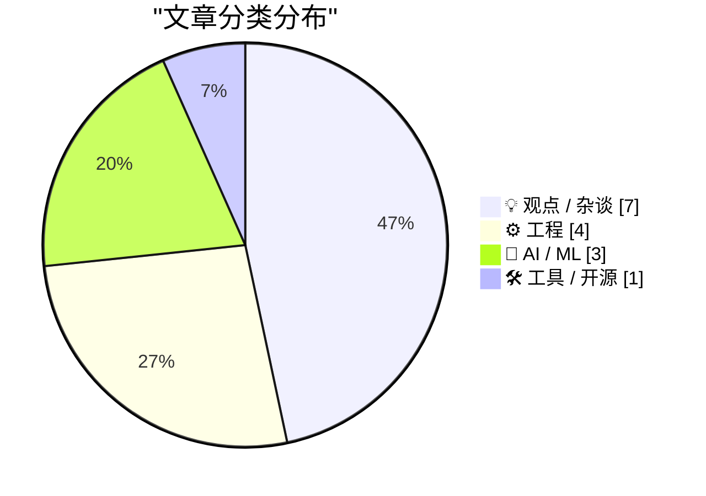
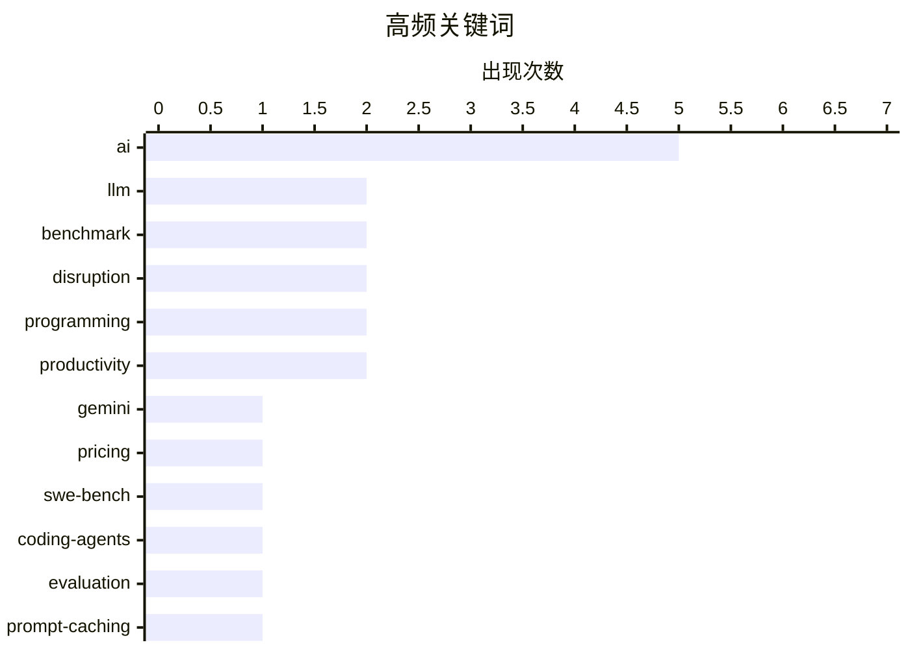

# 📰 AI 博客每日精选 — 2026-02-20

> 来自 Karpathy 推荐的 92 个顶级技术博客，AI 精选 Top 15

## 📝 今日看点

今日技术圈聚焦于 AI 大模型的持续迭代与行业冲击。Gemini 3.1 Pro 发布、SWE-bench 排行榜更新显示模型能力仍在快速提升，而 AI 对芯片需求的激增和专业技能的"吞噬效应"正在重塑产业格局。与此同时，技术社区对 AI 颠覆的讨论愈发激烈——从开发者工作流的变革到对效率与创造力本质的反思，业界正在经历一场深刻的认知转变。

---

## 🏆 今日必读

🥇 **Gemini 3.1 Pro**

[Gemini 3.1 Pro](https://simonwillison.net/2026/Feb/19/gemini-31-pro/#atom-everything) — simonwillison.net · 16 小时前 · 🤖 AI / ML

Gemini 3.1 Pro The first in the Gemini 3.1 series, priced the same as Gemini 3 Pro ($2/million input, $12/million output under 200,000 tokens, $4/$18 for 200,000 to 1,000,000). That's less than half t

🏷️ Gemini, LLM, pricing, benchmark

🥈 **SWE-bench February 2026 leaderboard update**

[SWE-bench February 2026 leaderboard update](https://simonwillison.net/2026/Feb/19/swe-bench/#atom-everything) — simonwillison.net · 1 天前 · 🤖 AI / ML

SWE-bench February 2026 leaderboard update SWE-bench is one of the benchmarks that the labs love to list in their model releases. The official leaderboard is infrequently updated but they just did a f

🏷️ SWE-bench, benchmark, coding-agents, evaluation

🥉 **Quoting Thariq Shihipar**

[Quoting Thariq Shihipar](https://simonwillison.net/2026/Feb/20/thariq-shihipar/#atom-everything) — simonwillison.net · 3 小时前 · ⚙️ 工程

Long running agentic products like Claude Code are made feasible by prompt caching which allows us to reuse computation from previous roundtrips and significantly decrease latency and cost. [...] At C

🏷️ prompt-caching, Claude, latency, optimization

---

## 📊 数据概览

| 扫描源 | 抓取文章 | 时间范围 | 精选 |
|:---:|:---:|:---:|:---:|
| 88/92 | 2493 篇 → 28 篇 | 48h | **15 篇** |

### 分类分布



### 高频关键词



<details>
<summary>📈 纯文本关键词图（终端友好）</summary>

```
ai            │ ████████████████████ 5
llm           │ ████████░░░░░░░░░░░░ 2
benchmark     │ ████████░░░░░░░░░░░░ 2
disruption    │ ████████░░░░░░░░░░░░ 2
programming   │ ████████░░░░░░░░░░░░ 2
productivity  │ ████████░░░░░░░░░░░░ 2
gemini        │ ████░░░░░░░░░░░░░░░░ 1
pricing       │ ████░░░░░░░░░░░░░░░░ 1
swe-bench     │ ████░░░░░░░░░░░░░░░░ 1
coding-agents │ ████░░░░░░░░░░░░░░░░ 1
```

</details>

### 🏷️ 话题标签

**ai**(5) · **llm**(2) · **benchmark**(2) · disruption(2) · programming(2) · productivity(2) · gemini(1) · pricing(1) · swe-bench(1) · coding-agents(1) · evaluation(1) · prompt-caching(1) · claude(1) · latency(1) · optimization(1) · generalist(1) · specialist(1) · career(1) · hardware(1) · nvidia(1)

---

## 💡 观点 / 杂谈

### 1. Quoting Martin Fowler

[Quoting Martin Fowler](https://simonwillison.net/2026/Feb/18/martin-fowler/#atom-everything) — **simonwillison.net** · 1 天前 · ⭐ 22/30

LLMs are eating specialty skills. There will be less use of specialist front-end and back-end developers as the LLM-driving skills become more important than the details of platform usage. Will this l

🏷️ LLM, generalist, specialist, career

---

### 2. The A.I. Disruption We’ve Been Waiting for Has Arrived

[The A.I. Disruption We’ve Been Waiting for Has Arrived](https://simonwillison.net/2026/Feb/18/the-ai-disruption/#atom-everything) — **simonwillison.net** · 1 天前 · ⭐ 21/30

The A.I. Disruption We’ve Been Waiting for Has Arrived New opinion piece from Paul Ford in the New York Times. Unsurprisingly for a piece by Paul it's packed with quoteworthy snippets, but a few stood

🏷️ AI, disruption, programming, industry-impact

---

### 3. Thinking Improves Thinking

[Thinking Improves Thinking](https://idiallo.com/blog/taking-our-mind-for-granted?src=feed) — **idiallo.com** · 1 天前 · ⭐ 20/30

How did we do it before ChatGPT? How did we write full sentences, connect ideas into a coherent arc, solve problems that had no obvious answer? We thought. That's it. We simply sat with discomfort lon

🏷️ ChatGPT, thinking, productivity, AI

---

### 4. Paul Ford: ‘The A.I. Disruption Has Arrived, and It Sure Is Fun’

[Paul Ford: ‘The A.I. Disruption Has Arrived, and It Sure Is Fun’](https://www.nytimes.com/2026/02/18/opinion/ai-software.html?unlocked_article_code=1.NFA.djaw.TBlAp8kE_N-i) — **daringfireball.net** · 1 天前 · ⭐ 19/30

Paul Ford, in an op-ed for The New York Times (gift link): All of the people I love hate this stuff, and all the people I hate love it. And yet, likely because of the same personality flaws that drew 

🏷️ AI, disruption, opinion

---

### 5. Is the Future “AWS for Everything”?

[Is the Future “AWS for Everything”?](https://www.construction-physics.com/p/is-the-future-aws-for-everything) — **construction-physics.com** · 21 小时前 · ⭐ 19/30

A theme running through my book is the idea that efficiency improvements, and the various methods for making products cheaper over time, have historically been dependent on some degree of repetition, 

🏷️ AWS, cloud, efficiency, production

---

### 6. 关于「用心」的几点随想

[A Few Rambling Observations on Care](https://blog.jim-nielsen.com/2026/observations-on-care/) — **blog.jim-nielsen.com** · 1 天前 · ⭐ 18/30

在 AI 时代，「品味」被视为新的核心技能，但作者认为「用心」（care）才是产品中更值得追求的品质。用心难以量化，当产品对话被数字独占仲裁时，用心可能会丧失——正如「一个人的死亡是悲剧，一百万人的死亡是统计数字」。规模化似乎会驱逐用心，因为用心与量化的简化本质相悖。作者主张用心应考虑有益的、建设性的系统性力量。

🏷️ AI, taste, care, product

---

### 7. 无需手动输入的类型标注

[Typing without having to type](https://simonwillison.net/2026/Feb/18/typing/#atom-everything) — **simonwillison.net** · 1 天前 · ⭐ 17/30

作者从事编程工作 25 年后，开始转向支持类型提示甚至强类型。过去抗拒类型系统是因为它降低了代码迭代速度，尤其在 REPL 环境中影响生产力。但当 AI 编码助手代劳所有类型标注工作时，显式定义类型的好处突然变得更有吸引力——类型系统的成本被 AI 吸收，收益却完整保留。

🏷️ type-hints, typing, programming, productivity

---

## ⚙️ 工程

### 8. Quoting Thariq Shihipar

[Quoting Thariq Shihipar](https://simonwillison.net/2026/Feb/20/thariq-shihipar/#atom-everything) — **simonwillison.net** · 3 小时前 · ⭐ 22/30

Long running agentic products like Claude Code are made feasible by prompt caching which allows us to reuse computation from previous roundtrips and significantly decrease latency and cost. [...] At C

🏷️ prompt-caching, Claude, latency, optimization

---

### 9. LadybirdBrowser/ladybird: Abandon Swift adoption

[LadybirdBrowser/ladybird: Abandon Swift adoption](https://simonwillison.net/2026/Feb/19/ladybird/#atom-everything) — **simonwillison.net** · 1 天前 · ⭐ 21/30

LadybirdBrowser/ladybird: Abandon Swift adoption Back in August 2024 the Ladybird browser project announced an intention to adopt Swift as their memory-safe language of choice. As of this commit it lo

🏷️ Swift, Ladybird, browser, memory-safety

---

### 10. ActivityPub

[ActivityPub](https://nesbitt.io/2026/02/20/activitypub.html) — **nesbitt.io** · 10 小时前 · ⭐ 18/30

ActivityPub 是一个用于发布活动公告的联邦协议，最早于 1714 年标准化，至今仍在 46,000 个活跃实例中使用。这是一篇简短的介绍性文章，以幽默的方式呈现了这个去中心化社交网络协议的历史和现状。

🏷️ ActivityPub, federated, protocol, social

---

### 11. WriteProcessMemory 能否通过避免中间缓冲区来提速？

[Could Write­Process­Memory be made faster by avoiding the intermediate buffer?](https://devblogs.microsoft.com/oldnewthing/20260218-00/?p=112069) — **devblogs.microsoft.com/oldnewthing** · 1 天前 · ⭐ 16/30

这是一篇关于 Windows API WriteProcessMemory 性能优化的简短讨论。作者认为理论上可以通过避免中间缓冲区来提速，但质疑这样做的必要性——暗示当前实现已经足够高效或优化收益不值得投入。文章极为简短，未展开技术细节。

🏷️ Windows, API, performance, memory

---

## 🤖 AI / ML

### 12. Gemini 3.1 Pro

[Gemini 3.1 Pro](https://simonwillison.net/2026/Feb/19/gemini-31-pro/#atom-everything) — **simonwillison.net** · 16 小时前 · ⭐ 25/30

Gemini 3.1 Pro The first in the Gemini 3.1 series, priced the same as Gemini 3 Pro ($2/million input, $12/million output under 200,000 tokens, $4/$18 for 200,000 to 1,000,000). That's less than half t

🏷️ Gemini, LLM, pricing, benchmark

---

### 13. SWE-bench February 2026 leaderboard update

[SWE-bench February 2026 leaderboard update](https://simonwillison.net/2026/Feb/19/swe-bench/#atom-everything) — **simonwillison.net** · 1 天前 · ⭐ 23/30

SWE-bench February 2026 leaderboard update SWE-bench is one of the benchmarks that the labs love to list in their model releases. The official leaderboard is infrequently updated but they just did a f

🏷️ SWE-bench, benchmark, coding-agents, evaluation

---

### 14. AI is a NAND Maximiser

[AI is a NAND Maximiser](https://shkspr.mobi/blog/2026/02/ai-is-a-nand-maximiser/) — **shkspr.mobi** · 22 小时前 · ⭐ 22/30

PC Gamer is reporting that the current demand by AI companies for computer chips is having a disastrous effect on the rest of the industry. In an interview, the CEO of Phison said: If NVIDIA Vera Rubi

🏷️ AI, hardware, NVIDIA, supply chain

---

## 🛠 工具 / 开源

### 15. 在树莓派上使用 Hailo 为 Frigate 提供物体检测

[Frigate with Hailo for object detection on a Raspberry Pi](https://www.jeffgeerling.com/blog/2026/frigate-with-hailo-for-object-detection-on-a-raspberry-pi/) — **jeffgeerling.com** · 1 天前 · ⭐ 18/30

Frigate 是一个安防摄像头录制和物体检测系统，可识别人、车、动物等目标。作者当前使用树莓派 CM4 配合 USB 接口的 Coral TPU 运行 Frigate 服务器。树莓派官方为 Pi 5 推出了多款内置 Hailo-8 或 Hailo-8L AI 协处理器的 AI HAT+，适合在树莓派上进行低功耗推理任务（如图像物体检测）。Hailo 协处理器也有 M.2 版本，可用于其他单板计算机和 PC。

🏷️ Raspberry-Pi, Hailo, object-detection, edge-AI

---

*生成于 2026-02-20 10:50 | 扫描 88 源 → 获取 2493 篇 → 精选 15 篇*
*基于 [Hacker News Popularity Contest 2025](https://refactoringenglish.com/tools/hn-popularity/) RSS 源列表，由 [Andrej Karpathy](https://x.com/karpathy) 推荐*
*由「懂点儿AI」制作，欢迎关注同名微信公众号获取更多 AI 实用技巧 💡*
