# 📰 AI 博客每日精选 — 2026-02-20

> 来自 Karpathy 推荐的 92 个顶级技术博客，AI 精选 Top 15

## 📝 今日看点

今日技术圈呈现出 AI 能力升级与开发范式变革的双重主题。Gemini 3.1 Pro 发布、SWE-bench 排行榜更新以及 AI 芯片需求激增，标志着大模型竞赛进入新阶段；与此同时，业界开始深度反思 AI 对开发者技能结构的冲击——从 Martin Fowler 预言前后端专业分工的消解，到 prompt caching 让长时运行的 AI 代理产品成为可能，再到开发者对类型系统和编程习惯的重新审视。这些讨论共同指向一个核心命题：AI 不仅在重塑工具链，更在重新定义"编程"这件事本身的意义。

---

## 🏆 今日必读

🥇 **Gemini 3.1 Pro**

[Gemini 3.1 Pro](https://simonwillison.net/2026/Feb/19/gemini-31-pro/#atom-everything) — simonwillison.net · 16 小时前 · 🤖 AI / ML

Gemini 3.1 Pro The first in the Gemini 3.1 series, priced the same as Gemini 3 Pro ($2/million input, $12/million output under 200,000 tokens, $4/$18 for 200,000 to 1,000,000). That's less than half t

🏷️ Gemini, LLM, pricing, benchmark

🥈 **Quoting Thariq Shihipar**

[Quoting Thariq Shihipar](https://simonwillison.net/2026/Feb/20/thariq-shihipar/#atom-everything) — simonwillison.net · 3 小时前 · ⚙️ 工程

Long running agentic products like Claude Code are made feasible by prompt caching which allows us to reuse computation from previous roundtrips and significantly decrease latency and cost. [...] At C

🏷️ prompt-caching, Claude, latency, optimization

🥉 **The A.I. Disruption We’ve Been Waiting for Has Arrived**

[The A.I. Disruption We’ve Been Waiting for Has Arrived](https://simonwillison.net/2026/Feb/18/the-ai-disruption/#atom-everything) — simonwillison.net · 1 天前 · 💡 观点 / 杂谈

The A.I. Disruption We’ve Been Waiting for Has Arrived New opinion piece from Paul Ford in the New York Times. Unsurprisingly for a piece by Paul it's packed with quoteworthy snippets, but a few stood

🏷️ AI, disruption, programming, industry-impact

---

## 📊 数据概览

| 扫描源 | 抓取文章 | 时间范围 | 精选 |
|:---:|:---:|:---:|:---:|
| 87/92 | 2483 篇 → 28 篇 | 48h | **15 篇** |

### 分类分布

```mermaid
pie showData
    title "文章分类分布"
    "💡 观点 / 杂谈" : 7
    "⚙️ 工程" : 4
    "🤖 AI / ML" : 3
    "🛠 工具 / 开源" : 1
```



### 高频关键词

```mermaid
xychart-beta horizontal
    title "高频关键词"
    x-axis ["ai", "llm", "benchmark", "disruption", "programming", "productivity", "gemini", "pricing", "prompt-caching", "claude", "latency", "optimization"]
    y-axis "出现次数" 0 --> 7
    bar [5, 2, 2, 2, 2, 2, 1, 1, 1, 1, 1, 1]
```



<details>
<summary>📈 纯文本关键词图（终端友好）</summary>

```
ai             │ ████████████████████ 5
llm            │ ████████░░░░░░░░░░░░ 2
benchmark      │ ████████░░░░░░░░░░░░ 2
disruption     │ ████████░░░░░░░░░░░░ 2
programming    │ ████████░░░░░░░░░░░░ 2
productivity   │ ████████░░░░░░░░░░░░ 2
gemini         │ ████░░░░░░░░░░░░░░░░ 1
pricing        │ ████░░░░░░░░░░░░░░░░ 1
prompt-caching │ ████░░░░░░░░░░░░░░░░ 1
claude         │ ████░░░░░░░░░░░░░░░░ 1
```

</details>

### 🏷️ 话题标签

**ai**(5) · **llm**(2) · **benchmark**(2) · disruption(2) · programming(2) · productivity(2) · gemini(1) · pricing(1) · prompt-caching(1) · claude(1) · latency(1) · optimization(1) · industry-impact(1) · generalist(1) · specialist(1) · career(1) · hardware(1) · nvidia(1) · supply chain(1) · swe-bench(1)

---

## 💡 观点 / 杂谈

### 1. The A.I. Disruption We’ve Been Waiting for Has Arrived

[The A.I. Disruption We’ve Been Waiting for Has Arrived](https://simonwillison.net/2026/Feb/18/the-ai-disruption/#atom-everything) — **simonwillison.net** · 1 天前 · ⭐ 22/30

The A.I. Disruption We’ve Been Waiting for Has Arrived New opinion piece from Paul Ford in the New York Times. Unsurprisingly for a piece by Paul it's packed with quoteworthy snippets, but a few stood

🏷️ AI, disruption, programming, industry-impact

---

### 2. Quoting Martin Fowler

[Quoting Martin Fowler](https://simonwillison.net/2026/Feb/18/martin-fowler/#atom-everything) — **simonwillison.net** · 1 天前 · ⭐ 22/30

LLMs are eating specialty skills. There will be less use of specialist front-end and back-end developers as the LLM-driving skills become more important than the details of platform usage. Will this l

🏷️ LLM, generalist, specialist, career

---

### 3. Thinking Improves Thinking

[Thinking Improves Thinking](https://idiallo.com/blog/taking-our-mind-for-granted?src=feed) — **idiallo.com** · 1 天前 · ⭐ 20/30

How did we do it before ChatGPT? How did we write full sentences, connect ideas into a coherent arc, solve problems that had no obvious answer? We thought. That's it. We simply sat with discomfort lon

🏷️ ChatGPT, thinking, productivity, AI

---

### 4. Typing without having to type

[Typing without having to type](https://simonwillison.net/2026/Feb/18/typing/#atom-everything) — **simonwillison.net** · 1 天前 · ⭐ 19/30

25+ years into my career as a programmer I think I may finally be coming around to preferring type hints or even strong typing. I resisted those in the past because they slowed down the rate at which 

🏷️ type-hints, typing, productivity, programming

---

### 5. Paul Ford: ‘The A.I. Disruption Has Arrived, and It Sure Is Fun’

[Paul Ford: ‘The A.I. Disruption Has Arrived, and It Sure Is Fun’](https://www.nytimes.com/2026/02/18/opinion/ai-software.html?unlocked_article_code=1.NFA.djaw.TBlAp8kE_N-i) — **daringfireball.net** · 1 天前 · ⭐ 19/30

Paul Ford, in an op-ed for The New York Times (gift link): All of the people I love hate this stuff, and all the people I hate love it. And yet, likely because of the same personality flaws that drew 

🏷️ AI, disruption, opinion

---

### 6. Is the Future “AWS for Everything”?

[Is the Future “AWS for Everything”?](https://www.construction-physics.com/p/is-the-future-aws-for-everything) — **construction-physics.com** · 21 小时前 · ⭐ 19/30

A theme running through my book is the idea that efficiency improvements, and the various methods for making products cheaper over time, have historically been dependent on some degree of repetition, 

🏷️ AWS, cloud, efficiency, production

---

### 7. A Few Rambling Observations on Care

[A Few Rambling Observations on Care](https://blog.jim-nielsen.com/2026/observations-on-care/) — **blog.jim-nielsen.com** · 1 天前 · ⭐ 18/30

In this new AI world, “taste” is the thing everyone claims is the new supreme skill. But I think “care” is the one I want to see in the products I buy. Can you measure care? Does scale drive out care?

🏷️ AI, taste, care, product

---

## ⚙️ 工程

### 8. Quoting Thariq Shihipar

[Quoting Thariq Shihipar](https://simonwillison.net/2026/Feb/20/thariq-shihipar/#atom-everything) — **simonwillison.net** · 3 小时前 · ⭐ 22/30

Long running agentic products like Claude Code are made feasible by prompt caching which allows us to reuse computation from previous roundtrips and significantly decrease latency and cost. [...] At C

🏷️ prompt-caching, Claude, latency, optimization

---

### 9. ActivityPub

[ActivityPub](https://nesbitt.io/2026/02/20/activitypub.html) — **nesbitt.io** · 10 小时前 · ⭐ 20/30

The federated protocol for announcing pub activities, first standardised in 1714 and still in use across 46,000 active instances.

🏷️ ActivityPub, federated, protocol, social

---

### 10. LadybirdBrowser/ladybird: Abandon Swift adoption

[LadybirdBrowser/ladybird: Abandon Swift adoption](https://simonwillison.net/2026/Feb/19/ladybird/#atom-everything) — **simonwillison.net** · 1 天前 · ⭐ 19/30

LadybirdBrowser/ladybird: Abandon Swift adoption Back in August 2024 the Ladybird browser project announced an intention to adopt Swift as their memory-safe language of choice. As of this commit it lo

🏷️ Swift, Ladybird, browser, memory-safety

---

### 11. Could Write­Process­Memory be made faster by avoiding the intermediate buffer?

[Could Write­Process­Memory be made faster by avoiding the intermediate buffer?](https://devblogs.microsoft.com/oldnewthing/20260218-00/?p=112069) — **devblogs.microsoft.com/oldnewthing** · 1 天前 · ⭐ 16/30

I guess it could, but why bother? The post Could Write&shy;Process&shy;Memory be made faster by avoiding the intermediate buffer? appeared first on The Old New Thing.

🏷️ Windows, API, performance, memory

---

## 🤖 AI / ML

### 12. Gemini 3.1 Pro

[Gemini 3.1 Pro](https://simonwillison.net/2026/Feb/19/gemini-31-pro/#atom-everything) — **simonwillison.net** · 16 小时前 · ⭐ 25/30

Gemini 3.1 Pro The first in the Gemini 3.1 series, priced the same as Gemini 3 Pro ($2/million input, $12/million output under 200,000 tokens, $4/$18 for 200,000 to 1,000,000). That's less than half t

🏷️ Gemini, LLM, pricing, benchmark

---

### 13. AI is a NAND Maximiser

[AI is a NAND Maximiser](https://shkspr.mobi/blog/2026/02/ai-is-a-nand-maximiser/) — **shkspr.mobi** · 22 小时前 · ⭐ 22/30

PC Gamer is reporting that the current demand by AI companies for computer chips is having a disastrous effect on the rest of the industry. In an interview, the CEO of Phison said: If NVIDIA Vera Rubi

🏷️ AI, hardware, NVIDIA, supply chain

---

### 14. SWE-bench February 2026 leaderboard update

[SWE-bench February 2026 leaderboard update](https://simonwillison.net/2026/Feb/19/swe-bench/#atom-everything) — **simonwillison.net** · 1 天前 · ⭐ 21/30

SWE-bench February 2026 leaderboard update SWE-bench is one of the benchmarks that the labs love to list in their model releases. The official leaderboard is infrequently updated but they just did a f

🏷️ SWE-bench, benchmark, coding-agents, evaluation

---

## 🛠 工具 / 开源

### 15. Frigate with Hailo for object detection on a Raspberry Pi

[Frigate with Hailo for object detection on a Raspberry Pi](https://www.jeffgeerling.com/blog/2026/frigate-with-hailo-for-object-detection-on-a-raspberry-pi/) — **jeffgeerling.com** · 1 天前 · ⭐ 18/30

I run Frigate to record security cameras and detect people, cars, and animals when in view. My current Frigate server runs on a Raspberry Pi CM4 and a Coral TPU plugged in via USB. Raspberry Pi offers

🏷️ Raspberry-Pi, Hailo, object-detection, edge-AI

---

*生成于 2026-02-20 10:53 | 扫描 87 源 → 获取 2483 篇 → 精选 15 篇*
*基于 [Hacker News Popularity Contest 2025](https://refactoringenglish.com/tools/hn-popularity/) RSS 源列表，由 [Andrej Karpathy](https://x.com/karpathy) 推荐*
*由「懂点儿AI」制作，欢迎关注同名微信公众号获取更多 AI 实用技巧 💡*
