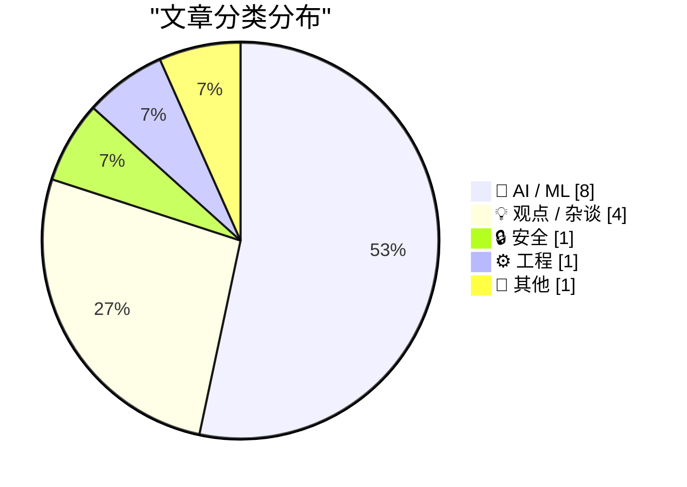
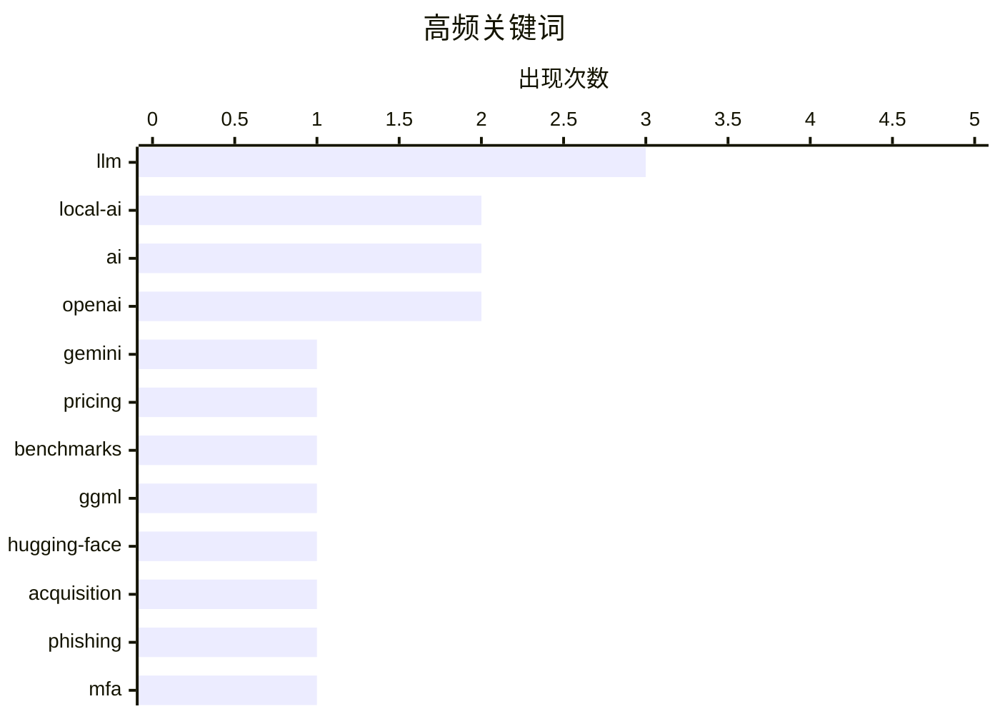

# 📰 AI 博客每日精选 — 2026-02-21

> 来自 Karpathy 推荐的 92 个顶级技术博客，AI 精选 Top 15

## 📝 今日看点

今日技术圈聚焦于 AI 基础设施的激烈竞争与本地化趋势。Gemini 3.1 Pro 发布、ggml.ai 加入 Hugging Face、以及 Taalas 实现每秒 17,000 tokens 的推理速度，显示出大模型正在性能与成本上展开全面角逐。与此同时，AI 芯片需求激增引发供应链担忧，而 prompt caching 等技术创新正在让长时运行的 AI Agent 产品成为可能。安全领域则出现了能够绕过多因素认证的新型钓鱼服务 Starkiller，为企业安全防护敲响警钟。

---

## 🏆 今日必读

🥇 **Gemini 3.1 Pro**

[Gemini 3.1 Pro](https://simonwillison.net/2026/Feb/19/gemini-31-pro/#atom-everything) — simonwillison.net · 1 天前 · 🤖 AI / ML

Gemini 3.1 Pro The first in the Gemini 3.1 series, priced the same as Gemini 3 Pro ($2/million input, $12/million output under 200,000 tokens, $4/$18 for 200,000 to 1,000,000). That's less than half t

🏷️ Gemini, LLM, pricing, benchmarks

🥈 **ggml.ai joins Hugging Face to ensure the long-term progress of Local AI**

[ggml.ai joins Hugging Face to ensure the long-term progress of Local AI](https://simonwillison.net/2026/Feb/20/ggmlai-joins-hugging-face/#atom-everything) — simonwillison.net · 11 小时前 · 🤖 AI / ML

ggml.ai joins Hugging Face to ensure the long-term progress of Local AI I don't normally cover acquisition news like this, but I have some thoughts. It's hard to overstate the impact Georgi Gerganov h

🏷️ ggml, Hugging-Face, local-AI, acquisition

🥉 **‘Starkiller’ Phishing Service Proxies Real Login Pages, MFA**

[‘Starkiller’ Phishing Service Proxies Real Login Pages, MFA](https://krebsonsecurity.com/2026/02/starkiller-phishing-service-proxies-real-login-pages-mfa/) — krebsonsecurity.com · 8 小时前 · 🔒 安全

Most phishing websites are little more than static copies of login pages for popular online destinations, and they are often quickly taken down by anti-abuse activists and security firms. But a stealt

🏷️ phishing, MFA, cybersecurity

---

## 📊 数据概览

| 扫描源 | 抓取文章 | 时间范围 | 精选 |
|:---:|:---:|:---:|:---:|
| 86/92 | 2459 篇 → 30 篇 | 48h | **15 篇** |

### 分类分布



### 高频关键词



<details>
<summary>📈 纯文本关键词图（终端友好）</summary>

```
llm          │ ████████████████████ 3
local-ai     │ █████████████░░░░░░░ 2
ai           │ █████████████░░░░░░░ 2
openai       │ █████████████░░░░░░░ 2
gemini       │ ███████░░░░░░░░░░░░░ 1
pricing      │ ███████░░░░░░░░░░░░░ 1
benchmarks   │ ███████░░░░░░░░░░░░░ 1
ggml         │ ███████░░░░░░░░░░░░░ 1
hugging-face │ ███████░░░░░░░░░░░░░ 1
acquisition  │ ███████░░░░░░░░░░░░░ 1
```

</details>

### 🏷️ 话题标签

**llm**(3) · **local-ai**(2) · **ai**(2) · openai(2) · gemini(1) · pricing(1) · benchmarks(1) · ggml(1) · hugging-face(1) · acquisition(1) · phishing(1) · mfa(1) · cybersecurity(1) · llama(1) · hardware-acceleration(1) · inference(1) · startup(1) · swe-bench(1) · benchmark(1) · coding(1)

---

## 🤖 AI / ML

### 1. Gemini 3.1 Pro

[Gemini 3.1 Pro](https://simonwillison.net/2026/Feb/19/gemini-31-pro/#atom-everything) — **simonwillison.net** · 1 天前 · ⭐ 25/30

Gemini 3.1 Pro The first in the Gemini 3.1 series, priced the same as Gemini 3 Pro ($2/million input, $12/million output under 200,000 tokens, $4/$18 for 200,000 to 1,000,000). That's less than half t

🏷️ Gemini, LLM, pricing, benchmarks

---

### 2. ggml.ai joins Hugging Face to ensure the long-term progress of Local AI

[ggml.ai joins Hugging Face to ensure the long-term progress of Local AI](https://simonwillison.net/2026/Feb/20/ggmlai-joins-hugging-face/#atom-everything) — **simonwillison.net** · 11 小时前 · ⭐ 24/30

ggml.ai joins Hugging Face to ensure the long-term progress of Local AI I don't normally cover acquisition news like this, but I have some thoughts. It's hard to overstate the impact Georgi Gerganov h

🏷️ ggml, Hugging-Face, local-AI, acquisition

---

### 3. Taalas serves Llama 3.1 8B at 17,000 tokens/second

[Taalas serves Llama 3.1 8B at 17,000 tokens/second](https://simonwillison.net/2026/Feb/20/taalas/#atom-everything) — **simonwillison.net** · 6 小时前 · ⭐ 23/30

Taalas serves Llama 3.1 8B at 17,000 tokens/second This new Canadian hardware startup just announced their first product - a custom hardware implementation of the Llama 3.1 8B model (from July 2024) t

🏷️ Llama, hardware-acceleration, inference, startup

---

### 4. SWE-bench February 2026 leaderboard update

[SWE-bench February 2026 leaderboard update](https://simonwillison.net/2026/Feb/19/swe-bench/#atom-everything) — **simonwillison.net** · 1 天前 · ⭐ 23/30

SWE-bench February 2026 leaderboard update SWE-bench is one of the benchmarks that the labs love to list in their model releases. The official leaderboard is infrequently updated but they just did a f

🏷️ SWE-bench, benchmark, coding, evaluation

---

### 5. AI is a NAND Maximiser

[AI is a NAND Maximiser](https://shkspr.mobi/blog/2026/02/ai-is-a-nand-maximiser/) — **shkspr.mobi** · 1 天前 · ⭐ 22/30

PC Gamer is reporting that the current demand by AI companies for computer chips is having a disastrous effect on the rest of the industry. In an interview, the CEO of Phison said: If NVIDIA Vera Rubi

🏷️ AI, hardware, supply chain, GPU

---

### 6. Quoting Thariq Shihipar

[Quoting Thariq Shihipar](https://simonwillison.net/2026/Feb/20/thariq-shihipar/#atom-everything) — **simonwillison.net** · 21 小时前 · ⭐ 20/30

Long running agentic products like Claude Code are made feasible by prompt caching which allows us to reuse computation from previous roundtrips and significantly decrease latency and cost. [...] At C

🏷️ Claude, prompt-caching, agentic, optimization

---

### 7. 引用 Thibault Sottiaux

[Quoting Thibault Sottiaux](https://simonwillison.net/2026/Feb/21/thibault-sottiaux/#atom-everything) — **simonwillison.net** · 3 小时前 · ⭐ 19/30

OpenAI 将 GPT-5.3-Codex-Spark 模型的推理速度提升了 30%，现在每秒可生成超过 1200 个 token。这是 OpenAI 工程师 Thibault Sottiaux 在社交媒体上宣布的性能优化成果。这一速度提升对代码生成场景尤为重要，意味着开发者可以更快获得 AI 辅助编程的响应。该优化展示了 OpenAI 在大模型推理性能上的持续改进能力。

🏷️ OpenAI, LLM, performance, inference-speed

---

### 8. Andrej Karpathy 谈论 "Claws"

[Andrej Karpathy talks about "Claws"](https://simonwillison.net/2026/Feb/21/claws/#atom-everything) — **simonwillison.net** · 3 小时前 · ⭐ 18/30

Andrej Karpathy 购买了 Mac Mini 来测试 Claws 技术，这是一种构建在 LLM 智能体之上的新架构层。Claws 提供了编排（orchestration）、调度（scheduling）、上下文管理、工具调用和持久化能力，类似于 LLM 智能体是 LLM 之上的一层，Claws 现在成为智能体之上的又一层抽象。Karpathy 对 OpenClaw 的安全性有所保留，但认可这个概念的价值。这标志着 AI 应用架构正在向更高层次的抽象演进。

🏷️ Claws, local-AI, Mac-Mini, OpenClaw

---

## 💡 观点 / 杂谈

### 9. Is the Future “AWS for Everything”?

[Is the Future “AWS for Everything”?](https://www.construction-physics.com/p/is-the-future-aws-for-everything) — **construction-physics.com** · 1 天前 · ⭐ 22/30

A theme running through my book is the idea that efficiency improvements, and the various methods for making products cheaper over time, have historically been dependent on some degree of repetition, 

🏷️ AWS, cloud, efficiency, infrastructure

---

### 10. Premium: The Hater's Guide to Anthropic

[Premium: The Hater's Guide to Anthropic](https://www.wheresyoured.at/premium-the-haters-guide-to-anthropic/) — **wheresyoured.at** · 10 小时前 · ⭐ 22/30

In May 2021, Dario Amodei and a crew of other former OpenAI researchers formed Anthropic and dedicated themselves to building the single-most-annoying Large Language Model company of all time.&#xA0;Pa

🏷️ Anthropic, LLM, AI-safety, OpenAI

---

### 11. 远程操控总是笑话的靶子

[Teleoperation is Always the Butt of the Joke](https://idiallo.com/blog/teleoperation-is-the-butt-of-the-joke?src=feed) — **idiallo.com** · 16 小时前 · ⭐ 19/30

几年前，"AI" 被戏称为 "Actual Indian"（真实的印度人），指机器背后其实是远程人工操作。亚马逊的 Just Walk Out 无人收银店就是典型案例：宣称使用 AI 自动结账，实际上依赖大量印度员工远程审核视频来确认购物内容。这种 "人工智能" 实为 "人工" 的现象揭示了许多所谓 AI 产品的真相。文章探讨了远程操控（teleoperation）在 AI 行业中被刻意隐藏却又频繁出现的尴尬现实。

🏷️ AI, teleoperation, automation

---

### 12. 难以承受的冗余之重

[The unbearable weight of cruft](https://www.joanwestenberg.com/the-unbearable-weight-of-cruft/) — **joanwestenberg.com** · 5 小时前 · ⭐ 17/30

文章标题指向技术债务和系统冗余（cruft）带来的负担问题。由于原文内容为空，无法提供具体的论点和案例分析。从标题推测，可能讨论软件开发中累积的无用代码、过时依赖或技术架构如何拖慢团队效率和系统性能。

🏷️ technical-debt, cruft, maintenance

---

## 🔒 安全

### 13. ‘Starkiller’ Phishing Service Proxies Real Login Pages, MFA

[‘Starkiller’ Phishing Service Proxies Real Login Pages, MFA](https://krebsonsecurity.com/2026/02/starkiller-phishing-service-proxies-real-login-pages-mfa/) — **krebsonsecurity.com** · 8 小时前 · ⭐ 24/30

Most phishing websites are little more than static copies of login pages for popular online destinations, and they are often quickly taken down by anti-abuse activists and security firms. But a stealt

🏷️ phishing, MFA, cybersecurity

---

## ⚙️ 工程

### 14. ActivityPub

[ActivityPub](https://nesbitt.io/2026/02/20/activitypub.html) — **nesbitt.io** · 1 天前 · ⭐ 20/30

The federated protocol for announcing pub activities, first standardised in 1714 and still in use across 46,000 active instances.

🏷️ ActivityPub, federation, protocol, decentralization

---

## 📝 其他

### 15. 苹果 3 月 4 日媒体活动的又一个猜想：Vision Pro 上的沉浸式 F1 体验？

[One More Spitball Idea for Apple’s March 4 Media Event ‘Experience’: Immersive F1 on Vision Pro?](https://www.formula1.com/en/latest/article/official-grand-prix-start-times-for-2026-f1-season-confirmed.2UgPfArqH76tzlOYh21jSG) — **daringfireball.net** · 1 天前 · ⭐ 16/30

2026 年 F1 赛季将于 3 月 8 日在澳大利亚开赛，Apple TV 是 F1 在美国的独家转播合作伙伴。苹果已经在 Vision Pro 上试水沉浸式体育直播，本赛季为湖人队比赛提供了有限的沉浸式观看体验。如果苹果计划为 F1 比赛提供 Vision Pro 沉浸式直播，3 月 4 日的媒体活动将是向媒体展示这一体验的理想时机。这可能成为苹果推广 Vision Pro 空间计算能力的重要应用场景。

🏷️ Vision Pro, VR, F1, immersive

---

*生成于 2026-02-21 04:31 | 扫描 86 源 → 获取 2459 篇 → 精选 15 篇*
*基于 [Hacker News Popularity Contest 2025](https://refactoringenglish.com/tools/hn-popularity/) RSS 源列表，由 [Andrej Karpathy](https://x.com/karpathy) 推荐*
*由「懂点儿AI」制作，欢迎关注同名微信公众号获取更多 AI 实用技巧 💡*
