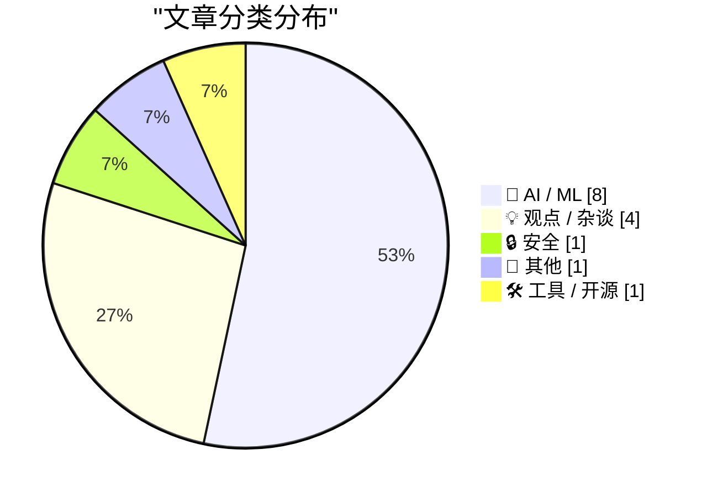
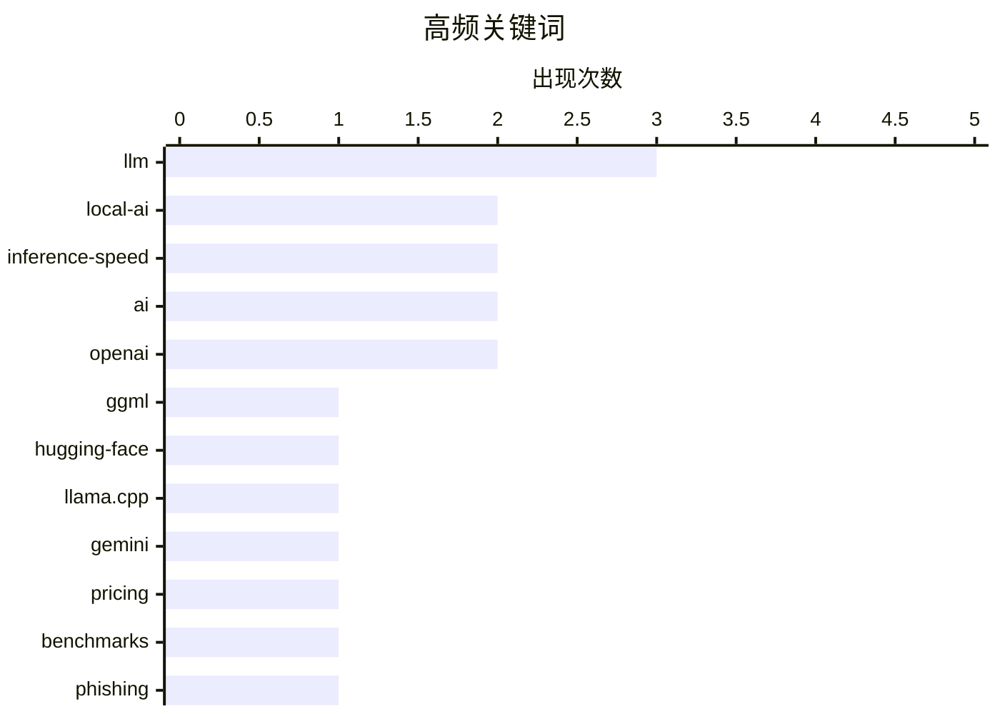

# 📰 AI 博客每日精选 — 2026-02-21

> 来自 Karpathy 推荐的 92 个顶级技术博客，AI 精选 Top 15

## 📝 今日看点

今日技术圈呈现出本地 AI 与云端 AI 的双轨发展态势：ggml.ai 加入 Hugging Face 推动消费级硬件本地推理，Taalas 以 17,000 tokens/秒刷新速度纪录，而 Gemini 3.1 Pro 则以不到竞品一半的价格重塑云端 AI 成本结构。AI 基础设施的供需矛盾日益凸显，芯片需求已严重挤压传统存储行业的 NAND 供应。与此同时，安全威胁也在升级——新型钓鱼服务 Starkiller 通过代理真实网站绕过传统防御，AI agent 产品则依赖提示缓存技术实现长时间运行的可行性。

---

## 🏆 今日必读

🥇 **ggml.ai 加入 Hugging Face 以确保本地 AI 的长期发展**

[ggml.ai joins Hugging Face to ensure the long-term progress of Local AI](https://simonwillison.net/2026/Feb/20/ggmlai-joins-hugging-face/#atom-everything) — simonwillison.net · 11 小时前 · 🤖 AI / ML

Georgi Gerganov 开发的 llama.cpp 在 2023 年 3 月首次让消费级硬件能够运行本地 LLM，通过 4-bit 量化技术在 MacBook 上实现模型推理。ggml.ai 现已被 Hugging Face 收购，这一收购将确保本地模型生态系统的持续发展和维护。llama.cpp 及其衍生项目已成为本地 AI 领域的基础设施，影响了整个开源模型社区。此次收购标志着本地 AI 技术从个人项目向企业级支持的转变。

💡 **为什么值得读**: 了解塑造本地 AI 生态系统的关键技术和人物，以及这一领域未来的发展方向。

🏷️ ggml, Hugging-Face, local-AI, llama.cpp

🥈 **Gemini 3.1 Pro**

[Gemini 3.1 Pro](https://simonwillison.net/2026/Feb/19/gemini-31-pro/#atom-everything) — simonwillison.net · 1 天前 · 🤖 AI / ML

Gemini 3.1 Pro 定价为 200 万输入 token 2 美元、200 万输出 token 12 美元（20 万 token 以下），不到 Claude Opus 4.6 价格的一半，但基准测试分数相近。Google 在发布公告中特别强调了相比 Gemini 3 Pro 改进的 SVG 动画性能。实测生成"骑自行车的鹈鹕"SVG 时思考了 323.9 秒。这是 Gemini 3.1 系列的首个模型，主打性价比优势。

💡 **为什么值得读**: 如果你在寻找高性能但价格更低的 AI 模型替代方案，这个新发布值得关注。

🏷️ Gemini, LLM, pricing, benchmarks

🥉 **'Starkiller' 钓鱼服务代理真实登录页面和多因素认证**

[‘Starkiller’ Phishing Service Proxies Real Login Pages, MFA](https://krebsonsecurity.com/2026/02/starkiller-phishing-service-proxies-real-login-pages-mfa/) — krebsonsecurity.com · 8 小时前 · 🔒 安全

传统钓鱼网站通常是静态复制的登录页面，容易被识别和封禁。新型钓鱼即服务平台 Starkiller 采用代理技术，加载目标品牌的真实网站，并在受害者和合法网站之间充当中继，转发用户名、密码和多因素认证信息。这种方式通过伪装链接绕过了静态页面检测和快速封禁两大传统防御手段。攻击者可以实时获取包括 MFA 在内的完整登录凭证。

💡 **为什么值得读**: 了解最新的钓鱼攻击技术演进，有助于提升安全意识和防护策略。

🏷️ phishing, MFA, cybersecurity

---

## 📊 数据概览

| 扫描源 | 抓取文章 | 时间范围 | 精选 |
|:---:|:---:|:---:|:---:|
| 87/92 | 2484 篇 → 29 篇 | 48h | **15 篇** |

### 分类分布



### 高频关键词



<details>
<summary>📈 纯文本关键词图（终端友好）</summary>

```
llm             │ ████████████████████ 3
local-ai        │ █████████████░░░░░░░ 2
inference-speed │ █████████████░░░░░░░ 2
ai              │ █████████████░░░░░░░ 2
openai          │ █████████████░░░░░░░ 2
ggml            │ ███████░░░░░░░░░░░░░ 1
hugging-face    │ ███████░░░░░░░░░░░░░ 1
llama.cpp       │ ███████░░░░░░░░░░░░░ 1
gemini          │ ███████░░░░░░░░░░░░░ 1
pricing         │ ███████░░░░░░░░░░░░░ 1
```

</details>

### 🏷️ 话题标签

**llm**(3) · **local-ai**(2) · **inference-speed**(2) · ai(2) · openai(2) · ggml(1) · hugging-face(1) · llama.cpp(1) · gemini(1) · pricing(1) · benchmarks(1) · phishing(1) · mfa(1) · cybersecurity(1) · llama(1) · hardware-acceleration(1) · custom-hardware(1) · swe-bench(1) · benchmark(1) · code-generation(1)

---

## 🤖 AI / ML

### 1. ggml.ai 加入 Hugging Face 以确保本地 AI 的长期发展

[ggml.ai joins Hugging Face to ensure the long-term progress of Local AI](https://simonwillison.net/2026/Feb/20/ggmlai-joins-hugging-face/#atom-everything) — **simonwillison.net** · 11 小时前 · ⭐ 24/30

Georgi Gerganov 开发的 llama.cpp 在 2023 年 3 月首次让消费级硬件能够运行本地 LLM，通过 4-bit 量化技术在 MacBook 上实现模型推理。ggml.ai 现已被 Hugging Face 收购，这一收购将确保本地模型生态系统的持续发展和维护。llama.cpp 及其衍生项目已成为本地 AI 领域的基础设施，影响了整个开源模型社区。此次收购标志着本地 AI 技术从个人项目向企业级支持的转变。

🏷️ ggml, Hugging-Face, local-AI, llama.cpp

---

### 2. Gemini 3.1 Pro

[Gemini 3.1 Pro](https://simonwillison.net/2026/Feb/19/gemini-31-pro/#atom-everything) — **simonwillison.net** · 1 天前 · ⭐ 24/30

Gemini 3.1 Pro 定价为 200 万输入 token 2 美元、200 万输出 token 12 美元（20 万 token 以下），不到 Claude Opus 4.6 价格的一半，但基准测试分数相近。Google 在发布公告中特别强调了相比 Gemini 3 Pro 改进的 SVG 动画性能。实测生成"骑自行车的鹈鹕"SVG 时思考了 323.9 秒。这是 Gemini 3.1 系列的首个模型，主打性价比优势。

🏷️ Gemini, LLM, pricing, benchmarks

---

### 3. Taalas 以 17,000 tokens/秒的速度运行 Llama 3.1 8B

[Taalas serves Llama 3.1 8B at 17,000 tokens/second](https://simonwillison.net/2026/Feb/20/taalas/#atom-everything) — **simonwillison.net** · 6 小时前 · ⭐ 23/30

加拿大硬件初创公司 Taalas 发布首款产品，基于定制硬件实现 Llama 3.1 8B 模型（2024 年 7 月版本），推理速度达到惊人的 17,000 tokens/秒。他们将其称为 Silicon Llama，采用激进量化策略，结合 3-bit 和 6-bit 参数。用户可在 chatjimmy.ai 体验，速度快到演示视频看起来像静态截图。下一代产品已在规划中。

🏷️ Llama, hardware-acceleration, inference-speed, custom-hardware

---

### 4. SWE-bench 2026 年 2 月排行榜更新

[SWE-bench February 2026 leaderboard update](https://simonwillison.net/2026/Feb/19/swe-bench/#atom-everything) — **simonwillison.net** · 1 天前 · ⭐ 23/30

SWE-bench 是各大 AI 实验室发布模型时常引用的基准测试，官方排行榜刚完成了针对当前一代模型的完整测试。此次更新的是 Bash Only 基准测试结果，运行约 9,000 行 Python 代码的 mini-swe-bench agent。这次更新的重要性在于提供了非实验室自报告的独立测试结果，可以更客观地评估各模型的实际代码能力。

🏷️ SWE-bench, benchmark, code-generation, evaluation

---

### 5. AI 是 NAND 最大化器

[AI is a NAND Maximiser](https://shkspr.mobi/blog/2026/02/ai-is-a-nand-maximiser/) — **shkspr.mobi** · 1 天前 · ⭐ 22/30

PC Gamer 报道称 AI 公司对芯片的需求正在严重影响其他行业。Phison CEO 在采访中表示，如果 NVIDIA Vera Rubin 出货数千万台，每台需要 20+TB SSD，将消耗去年全球 NAND 产能的约 20%。NAND 是一种微芯片类型，AI 训练和推理硬件的大规模部署正在挤占存储芯片的生产能力。这种资源竞争可能导致其他行业的存储成本上升和供应短缺。

🏷️ AI, hardware, supply chain, GPU

---

### 6. 引用 Thariq Shihipar

[Quoting Thariq Shihipar](https://simonwillison.net/2026/Feb/20/thariq-shihipar/#atom-everything) — **simonwillison.net** · 21 小时前 · ⭐ 20/30

Claude Code 等长时间运行的 AI agent 产品依赖提示缓存（prompt caching）技术，通过重用先前计算降低延迟和成本。Claude Code 团队围绕提示缓存构建整个系统架构，高缓存命中率能降低成本并提供更慷慨的订阅计划速率限制。团队对提示缓存命中率设置了监控告警，命中率过低会触发 SEV（严重事件）响应。这表明提示缓存已成为 AI agent 产品经济可行性的关键技术。

🏷️ prompt-caching, Claude, agentic-AI, optimization

---

### 7. 引用 Thibault Sottiaux

[Quoting Thibault Sottiaux](https://simonwillison.net/2026/Feb/21/thibault-sottiaux/#atom-everything) — **simonwillison.net** · 3 小时前 · ⭐ 19/30

OpenAI 将 GPT-5.3-Codex-Spark 模型的推理速度提升了 30%，现在达到每秒 1200 tokens 以上的输出速度。这是 OpenAI 员工 Thibault Sottiaux 在社交媒体上公布的性能优化成果。该模型专注于代码生成场景，大幅提升了开发者使用 AI 编程助手的响应体验。

🏷️ OpenAI, LLM, performance, inference-speed

---

### 8. Andrej Karpathy 谈论"Claws"

[Andrej Karpathy talks about "Claws"](https://simonwillison.net/2026/Feb/21/claws/#atom-everything) — **simonwillison.net** · 3 小时前 · ⭐ 18/30

Andrej Karpathy 专门购买了 Mac Mini 来测试 Claws 技术，这是一种构建在 LLM Agent 之上的新抽象层。Claws 在 LLM Agent 的基础上增加了编排、调度、上下文管理、工具调用和持久化能力。Karpathy 认为 Claws 代表了 AI 应用架构的演进：从 LLM 到 LLM Agent，再到 Claws 这一更高层次的抽象。他对 OpenClaw 的安全性有所保留，但对整体概念表示认可。

🏷️ Claws, local-AI, Mac-Mini, OpenClaw

---

## 💡 观点 / 杂谈

### 9. 远程操控总是笑话的靶子

[Teleoperation is Always the Butt of the Joke](https://idiallo.com/blog/teleoperation-is-the-butt-of-the-joke?src=feed) — **idiallo.com** · 16 小时前 · ⭐ 21/30

几年前，AI 被戏称为 Actual Indian（真实的印度人），指机器背后实际是远程操作的人工。亚马逊的无人收银商店 Just Walk Out 声称使用 AI 自动结账，但实际运作方式一直不明确。远程操控（Teleoperation）技术在多个所谓的 AI 应用中被隐藏使用，公司倾向于用 AI 标签包装人工操作的服务。这种做法引发了关于技术真实性和营销透明度的质疑。

🏷️ AI, teleoperation, automation

---

### 10. Premium：Anthropic 批评者指南

[Premium: The Hater's Guide to Anthropic](https://www.wheresyoured.at/premium-the-haters-guide-to-anthropic/) — **wheresyoured.at** · 10 小时前 · ⭐ 21/30

2021 年 5 月，Dario Amodei 和其他前 OpenAI 研究人员创立了 Anthropic，声称致力于构建最安全的大语言模型公司。文章以批判视角审视 Anthropic 的发展历程和商业策略，质疑其安全承诺与实际行为之间的一致性。作者认为 Anthropic 可能是最令人恼火的 LLM 公司，暗示其安全叙事与商业现实存在矛盾。

🏷️ Anthropic, LLM, AI-safety, OpenAI

---

### 11. 未来是"万物 AWS 化"吗？

[Is the Future “AWS for Everything”?](https://www.construction-physics.com/p/is-the-future-aws-for-everything) — **construction-physics.com** · 1 天前 · ⭐ 20/30

作者在书中提出的主题是，效率改进和降低产品成本的各种方法历史上依赖于某种程度的重复性，即反复运行生产流程。这一观点探讨了规模化生产和标准化服务模式（如 AWS 云服务模式）是否会扩展到更多行业和领域。文章讨论了重复性生产如何成为成本优化的基础，以及这种模式的普适性和局限性。

🏷️ AWS, cloud, infrastructure, efficiency

---

### 12. 难以承受的冗余之重

[The unbearable weight of cruft](https://www.joanwestenberg.com/the-unbearable-weight-of-cruft/) — **joanwestenberg.com** · 5 小时前 · ⭐ 17/30

文章内容未提供足够信息进行摘要。

🏷️ technical-debt, cruft, software-maintenance

---

## 🔒 安全

### 13. 'Starkiller' 钓鱼服务代理真实登录页面和多因素认证

[‘Starkiller’ Phishing Service Proxies Real Login Pages, MFA](https://krebsonsecurity.com/2026/02/starkiller-phishing-service-proxies-real-login-pages-mfa/) — **krebsonsecurity.com** · 8 小时前 · ⭐ 24/30

传统钓鱼网站通常是静态复制的登录页面，容易被识别和封禁。新型钓鱼即服务平台 Starkiller 采用代理技术，加载目标品牌的真实网站，并在受害者和合法网站之间充当中继，转发用户名、密码和多因素认证信息。这种方式通过伪装链接绕过了静态页面检测和快速封禁两大传统防御手段。攻击者可以实时获取包括 MFA 在内的完整登录凭证。

🏷️ phishing, MFA, cybersecurity

---

## 📝 其他

### 14. 苹果 3 月 4 日媒体活动的又一个猜测：Vision Pro 上的沉浸式 F1 体验？

[One More Spitball Idea for Apple’s March 4 Media Event ‘Experience’: Immersive F1 on Vision Pro?](https://www.formula1.com/en/latest/article/official-grand-prix-start-times-for-2026-f1-season-confirmed.2UgPfArqH76tzlOYh21jSG) — **daringfireball.net** · 1 天前 · ⭐ 16/30

2026 年 F1 赛季将于 3 月 8 日在澳大利亚开幕，而苹果恰好在 3 月 4 日举办媒体活动。Apple TV 已成为 F1 在美国的独家转播合作伙伴，且苹果正在为 Vision Pro 试验沉浸式体育直播（目前有湖人队比赛）。作者推测苹果可能在 3 月 4 日的活动上展示 Vision Pro 的 F1 沉浸式直播体验，时间点与赛季开幕高度吻合。

🏷️ Vision Pro, VR, sports

---

## 🛠 工具 / 开源

### 15. CloudPebble 回归！新增纯 JavaScript 和 Round 2 SDK

[CloudPebble Returns! Plus New Pure JavaScript and Round 2 SDK](https://repebble.com/blog/cloudpebble-returns-plus-pure-javascript-and-round-2-sdk) — **ericmigi.com** · 1 天前 · ⭐ 16/30

Pebble 智能手表的云端开发环境 CloudPebble 重新上线，同时带来了重要的 SDK 更新。新版本支持纯 JavaScript 开发，并为 Pebble Round 2 圆形表盘提供了专门的 SDK。这是 Repebble 社区软件路线图中的重要里程碑，旨在改进 Pebble 已有的开发工具链。

🏷️ Pebble, SDK, JavaScript

---

*生成于 2026-02-21 04:35 | 扫描 87 源 → 获取 2484 篇 → 精选 15 篇*
*基于 [Hacker News Popularity Contest 2025](https://refactoringenglish.com/tools/hn-popularity/) RSS 源列表，由 [Andrej Karpathy](https://x.com/karpathy) 推荐*
*由「懂点儿AI」制作，欢迎关注同名微信公众号获取更多 AI 实用技巧 💡*
